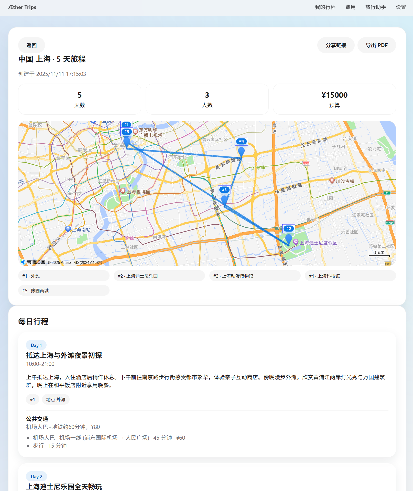

# AI Travel Planner (Web)

Æther Trips 是一款语音驱动的 Web 端 AI 旅行助手：输入或说出目的地、天数、预算与偏好后，系统会生成逐日行程、公共交通方案、地图动线以及来自高德官方推荐榜单的酒店建议。

## 亮点功能

- **智能行程规划**
  - `/api/plan` 使用用户提供的 OpenAI 兼容 LLM（未配置时回退到本地 Mock）。
  - 页面按时间线展示亮点标签与交通方案。
    

- **高德酒店 / POI 实时数据**
  - 调用高德 Place API 获取真实酒店列表，首页酒店卡片展示评分、价格、地址、标签等真实信息，源自高德返回结果。
    

- **记录可查 + 导出分享**
  - “我的行程”详情页包含地图、逐日行程、公共交通方案，可一键导出 PDF（`window.print`) 或调用 Web Share API 分享链接。
  - 数据默认储存在 IndexedDB，可在设置页开启 Supabase 云同步。
    

- **语音输入**
  - 浏览器 Web Speech API 提供语音输入，无需额外 Key。


## 快速开始

```bash
npm install
npm run dev   # http://localhost:3000
```

运行后进入“设置”页粘贴：

- 地图 JS Key：高德或百度 JS SDK Key；
- 高德 Web 服务 Key：用于真实酒店/POI API；
- LLM：OpenAI 兼容 Base URL / Model / API Key（可使用阿里云百炼兼容接口）；
- Supabase（可选）：项目 URL 与 Anon Key。

Docker：

```bash
docker run -p 3000:3000 ranakaname/ai-travel-planner
```

## 数据与安全

- 所有 Key 均保存在浏览器 IndexedDB，不会进入仓库。
- `/api/plan`、`/api/budget` 只有在提供 LLM Key 时才访问远程模型；否则返回本地 Mock。

