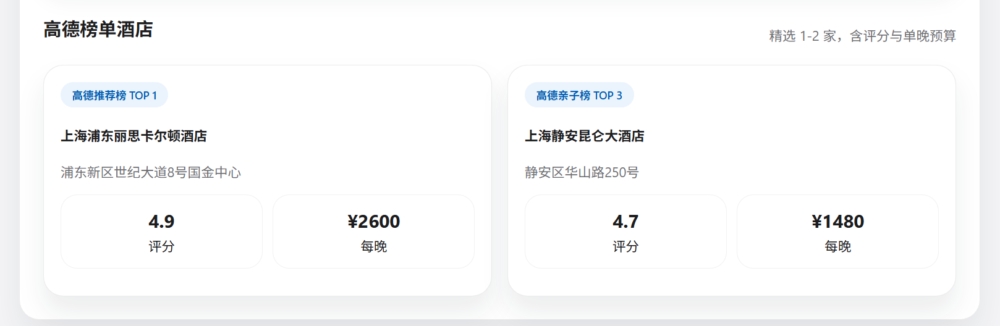

# AI Travel Planner (Web)

Æther Trips 是一款语音驱动的 Web 端 AI 旅行助手：输入（或说出）目的地、天数、预算与偏好后，系统会生成逐日行程、公共交通方案、地图动线以及来自高德官方推荐榜单的酒店建议。

## 亮点功能

- **智能行程规划**
  - `/api/plan` 使用用户提供的 OpenAI 兼容 LLM（未配置时回退到本地 Mock）。
  - Prompt 强制输出结构化 JSON：每日行程带 `location.lat/lng`（仅供地图绘制）、`transit.segments`（地铁/公交/火车等公共交通耗时与费用）以及 `hotels`。
  - 页面按时间线展示亮点标签与交通方案，并通过 `# 编号` 和图钉对应地点。

- **高德酒店 / POI 实时数据**
  - 调用高德 Place API 获取真实酒店列表，首页酒店卡片展示评分、价格、地址、标签等真实信息，源自高德返回结果。
  - 

- **地图 + 交通联动**
  - 支持高德/百度地图 SDK，图钉样式与高德一致，悬停可见 “#N · 地名”。
  - 按公共交通方案的主要方式动态设置路线颜色（地铁、公交、高铁等），一眼看出动线类型。
  - 面板同步列出 “#N ↔ 地名” 的对应关系，满足“在地图上显示每天要去的地方”的需求且无需暴露经纬度。

- **记录可查 + 导出分享**
  - “我的行程”详情页包含地图、逐日行程、公共交通方案，可一键导出 PDF（`window.print`) 或调用 Web Share API 分享链接。
  - 数据默认储存在 IndexedDB，可在设置页开启 Supabase 云同步。

- **语音输入 + 费用管理**
  - 浏览器 Web Speech API 提供语音输入，无需额外 Key。
  - 费用页支持语音记账，本地 IndexedDB 持久化。


## 快速开始

```bash
npm install
npm run dev   # http://localhost:3000
```

运行后进入“设置”页粘贴：

- 地图 JS Key：高德或百度 JS SDK Key；
- 高德 Web 服务 Key：用于真实酒店/POI API；
- LLM：OpenAI 兼容 Base URL / Model / API Key（可使用阿里云百炼兼容接口）；
- Supabase（可选）：项目 URL 与 Anon Key。

Docker：

```bash
docker run -p 3000:3000 ranakaname/ai-travel-planner
```

## 设计与交互

- 半透明玻璃拟态 + 大圆角卡片 + SF Pro 风格排版。
- 首页整合表单、地图、每日行程、公共交通与酒店卡片，信息层级清晰。
- MapView 使用编号图钉 + 悬停提示，并按交通方式渲染路线颜色。

## 数据与安全

- 所有 Key 均保存在浏览器 IndexedDB，不会进入仓库。
- `/api/plan`、`/api/budget` 只有在提供 LLM Key 时才访问远程模型；否则返回本地 Mock。
- README、submission.pdf 均提醒不要在代码中硬编码密钥。

## 部署 / CI

- `Dockerfile` 采用多阶段构建，最终基于 `node:20-alpine` 运行 Next.js standalone 产物。
- `.github/workflows/docker.yml` 可在 push 时构建镜像；配置 `ALIYUN_*` 与 `IMAGE_NAME` 后可自动推送到阿里云镜像仓库。
- `submission.pdf` 提供仓库链接与 README 摘要，方便交付材料。

## 常用脚本

- `npm run dev`
- `npm run build`
- `npm run start`
- `npm run lint`

## 进一步的演进想法

1. 将公共交通线路进一步拆分多段路径，并叠加实时拥堵或时刻表信息。
2. 在 `/trips/[id]` 导出的 PDF 中嵌入地图快照与分享二维码。
3. 支持多目的地串联路线与跨城市酒店自动匹配。

